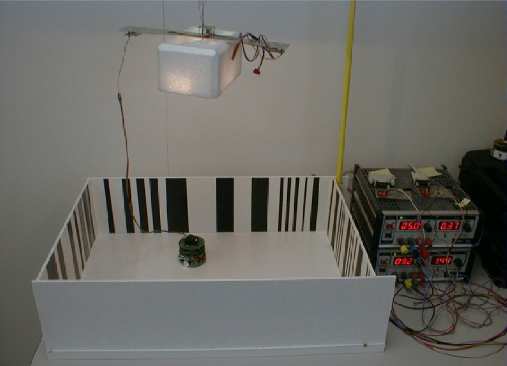
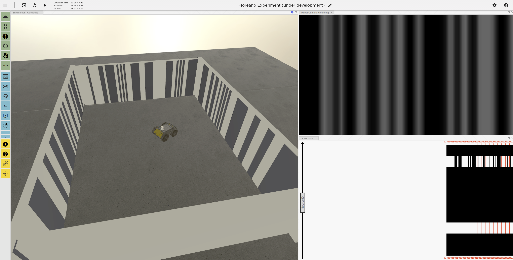

# Evolving Spiking Neural Controllers for Automous Collision-Free Navigation in the Neurorobotics Platform

This repository contains a Neurorobotics Platform (NRP) [1] experiment files. The experiment's aim is to reproduce results of an experiment conducted in [2] but in simulation.

## References

[1] 

[2] D. Floreano and C. Mattiussi, “Evolution of Spiking Neural Controllers for Autonomous Vision-Based Robots,” Lect. Notes Comput. Sci., vol. 2217, pp. 38–61, 2001. 
